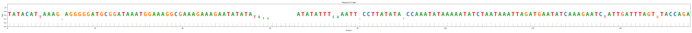
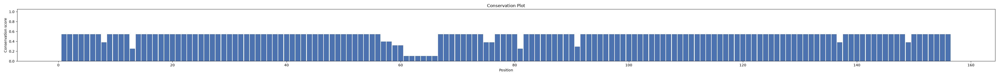
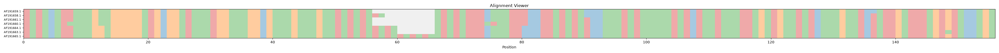
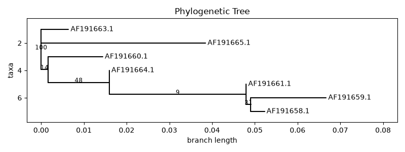
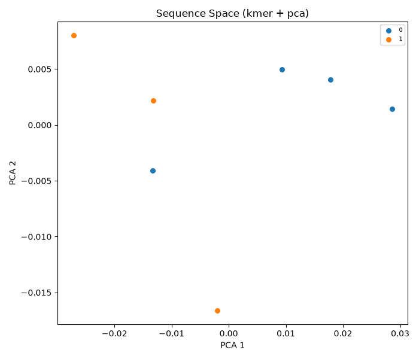

# BioExplorer チュートリアル

このドキュメントは、BioExplorerの各機能を実データで動かすための実践ガイドです。

1. インストール(コア機能 + 各機能に必要な外部ツール/DB)
2. 実データの入手方法
3. 実データを使った全機能の実行例(このリポジトリの`examples/opuntia/`に同梱の実データで実際に動かした結果を掲載)
4. 典型的なワークフロー
5. トラブルシューティング

---

## 1. インストール

### 1.1 コア機能

```bash
git clone <this-repo>
cd bioexplorer
uv sync            # biopython, click が入る。これだけで import/descriptor/search(kmer,minhash)/
                    # align(pairwise)/profile/logo/cluster(greedy)/tree(nj,upgma)/dnds(NG86,LWL85)/
                    # structure(解析系)/plot(alignment,tree)/replay が動く
uv run bio --help
```

### 1.2 オプション機能(Python extras)

```bash
uv sync --extra cluster   # scipy, scikit-learn -> クラスタリングの一部内部計算、bio embed --reduce pca/tsne
uv sync --extra embed     # umap-learn -> bio embed --reduce umap
uv sync --extra viz       # matplotlib, cairosvg -> bio plot / bio logo / bio profile --plot
# 複数同時指定も可能
uv sync --extra cluster --extra embed --extra viz
```

### 1.3 外部ツール(バイナリ)一覧

BioExplorerは仕様書の方針通り、専門的な計算処理の多くを外部ツールに委譲します。**未導入でも該当コマンドを打った時に「何が足りないか」を明示するエラーが出るだけで、他の機能には影響しません**。必要になった機能の分だけ入れてください。

大半は[Bioconda](https://bioconda.github.io/)で一括インストールできます(推奨):

```bash
conda create -n bioexplorer-tools -c bioconda -c conda-forge \
    mafft muscle clustalo \
    blast diamond mmseqs2 cd-hit \
    iqtree fasttree raxml \
    paml dssp
conda activate bioexplorer-tools
```

個別に入れる場合の対応表:

| 機能 | コマンド | 必要なツール | インストール例 |
|---|---|---|---|
| 高精度類似性検索 | `bio search FILE --method blast` | BLAST+ | `apt install ncbi-blast+` / `conda install -c bioconda blast` |
| 高精度類似性検索 | `bio search FILE --method diamond` | DIAMOND | `conda install -c bioconda diamond` / [公式](https://github.com/bbuchfink/diamond/releases) |
| 高精度類似性検索・クラスタリング | `--method mmseqs` | MMseqs2 | `conda install -c bioconda mmseqs2` / [公式](https://github.com/soedinglab/MMseqs2) |
| 多重整列 | `bio align --tool mafft` | MAFFT | `apt install mafft` / `conda install -c bioconda mafft` |
| 多重整列 | `bio align --tool muscle` | MUSCLE (v5系) | `conda install -c bioconda muscle` |
| 多重整列 | `bio align --tool clustalo` | Clustal Omega | `apt install clustalo` / `conda install -c bioconda clustalo` |
| クラスタリング | `bio cluster --method cdhit` | CD-HIT | `apt install cd-hit` / `conda install -c bioconda cd-hit` |
| 系統樹 | `bio tree --method iqtree` | IQ-TREE2 | `conda install -c bioconda iqtree` |
| 系統樹 | `bio tree --method fasttree` | FastTree | `apt install fasttree` / `conda install -c bioconda fasttree` |
| 系統樹 | `bio tree --method raxml` | RAxML / raxml-ng | `conda install -c bioconda raxml raxml-ng` |
| dN/dS(高精度) | `bio dnds --method YN00` | PAML(yn00) | `conda install -c bioconda paml` |
| 二次構造 | `bio structure ss` | DSSP | `apt install dssp` / `conda install -c bioconda dssp` |
| 構造ビューア | `bio structure view --viewer vmd` | VMD | [公式サイトで要登録DL](https://www.ks.uiuc.edu/Research/vmd/) |
| 構造ビューア | `bio structure view --viewer chimerax` | ChimeraX | [公式サイトで要登録DL](https://www.cgl.ucsf.edu/chimerax/) |
| 構造ビューア | `bio structure view --viewer pymol` | PyMOL | `conda install -c conda-forge pymol-open-source` |
| 構造予測 | `bio structure predict --engine colabfold` | ColabFold | [GitHub](https://github.com/sokrypton/ColabFold)(GPU推奨、`pip install colabfold`) |
| 構造予測 | `bio structure predict --engine alphafold` | AlphaFold | [GitHub](https://github.com/google-deepmind/alphafold)(大容量DB + GPU必須) |
| 構造予測 | `bio structure predict --engine modeller` | MODELLER | [salilab.org](https://salilab.org/modeller/)(要ライセンス、`conda install -c salilab modeller`) |
| 埋め込み(ESM) | `bio embed --method esm` | fair-esm + PyTorch | `pip install fair-esm torch` |
| 埋め込み(ProtT5) | `bio embed --method prott5` | transformers + PyTorch | `pip install transformers torch sentencepiece` |

---

## 2. 実データの入手方法

### 2.1 NCBI(DNA/RNA/タンパク質、GenBank形式)

NCBI E-utilitiesで配列を直接ダウンロードできます(APIキーなしでも動きますが、大量アクセスするなら[APIキー取得](https://www.ncbi.nlm.nih.gov/account/)推奨):

```bash
# 例: ヒトのBRCA1 mRNA配列(NM_007294)をFASTAで取得
curl "https://eutils.ncbi.nlm.nih.gov/entrez/eutils/efetch.fcgi?db=nuccore&id=NM_007294&rettype=fasta&retmode=text" \
  -o brca1.fasta

# 例: 特定の生物種・遺伝子で検索してIDリストを取得 -> まとめて取得
curl "https://eutils.ncbi.nlm.nih.gov/entrez/eutils/esearch.fcgi?db=protein&term=globin+AND+human[organism]&retmax=20" \
  -o search_result.xml
# search_result.xml の <Id> を集めて efetch に渡す
```

### 2.2 UniProt(タンパク質)

```bash
# 例: ヒトインスリン(P01308)をFASTAで取得
curl "https://rest.uniprot.org/uniprotkb/P01308.fasta" -o insulin.fasta

# 例: クエリ検索(globin, reviewed, human)して複数配列を一括取得
curl "https://rest.uniprot.org/uniprotkb/search?query=globin+AND+organism_id:9606+AND+reviewed:true&format=fasta&size=50" \
  -o globins_human.fasta
```

### 2.3 PDB / AlphaFold DB(タンパク質構造)

```bash
# 例: PDBエントリ 1A91 の構造ファイル
curl "https://files.rcsb.org/download/1A91.pdb" -o 1A91.pdb

# 例: UniProt ID P01308 に対応するAlphaFold予測構造
curl "https://alphafold.ebi.ac.uk/files/AF-P01308-F1-model_v4.pdb" -o insulin_af.pdb
```

### 2.4 このリポジトリに同梱の実データ

`examples/opuntia/` に、本チュートリアルの実行例で実際に使った**本物の実データ**を同梱しています。ウチワサボテン(*Opuntia*)の葉緑体rpl16イントロン領域、NCBI accession `AF191658`〜`AF191665`の7配列で、[Biopythonの公式チュートリアル](https://biopython.org/)でも系統解析の例として使われている定番データセットです。

- `opuntia_raw.fasta` — 生配列(`bio import`用、ギャップなし)
- `opuntia_aligned.fasta` — 上記のNCBI公開アラインメント済みバージョン(`bio profile`/`bio tree`用)
- `outputs/` — 本チュートリアルで実際に生成した出力(画像・CSV)

`examples/illustrative/` には、dN/dSと構造解析の説明用に**実データではない**簡易サンプル(`dnds_pair.fasta`、`toy_structure.pdb`)を置いています。本物のCDSペアやPDB構造は2.1〜2.3の方法で取得してください。

---

## 3. 実行例(実データ)

以下はすべて `examples/opuntia/` の実データに対して実際に実行し、そのままの出力を貼っています。

### 3.1 import / status

```bash
$ bio import examples/opuntia/opuntia_raw.fasta
imported 7 record(s); project total 7 (dna=7)

$ bio status
records: 7
  dna: 7
```

### 3.2 descriptor

```bash
$ bio descriptor
computed descriptors for 7 record(s)
```

GC%は24〜26%前後(葉緑体イントロンらしいAT-rich配列)であることが分かります:

```bash
$ bio search --field descriptor.gc_percent --field-max 25
1640bf476ee3    AF191658.1  dna 148
9387eef79fb2    AF191661.1  dna 146
71d3fd9e6ca5    AF191660.1  dna 146
a3e910bedbf9    AF191663.1  dna 150
26e83057c7a5    AF191665.1  dna 156
-- 5/7 record(s) matched
```

(seq_idは`bio import`のたびにランダムに再生成されるため、実行するたびに変わります。)

### 3.3 search(類似性検索)

```bash
$ bio search examples/opuntia/opuntia_raw.fasta --method kmer --top-n 3
note: examples/opuntia/opuntia_raw.fasta has 7 sequences; using the first ('AF191659.1') as query
1c32b0b3ceeb    AF191659.1  dna 146 score=1.0
1640bf476ee3    AF191658.1  dna 148 score=0.9518
9387eef79fb2    AF191661.1  dna 146 score=0.9518
-- 3 hit(s) (method=kmer)
```

**公共DBに対する検索**: `--method blast/diamond/mmseqs`はデフォルトではプロジェクト内の配列から一時DBを作って検索しますが、`--db`で既存のDBを指定すれば、NCBI nr/nt、UniRef、Pfam等の公共DBに対してそのまま検索できます。DBは各ツール公式のダウンローダを`bio db fetch`でラップしています(車輪の再発明はしていません):

```bash
# BLAST用DBをダウンロード(update_blastdb.plのラッパー)
bio db fetch swissprot --tool blast --output ./blastdb/swissprot

# MMseqs2用DBをダウンロード(mmseqs databasesのラッパー)
bio db fetch UniRef50 --tool mmseqs --output ./mmseqs_db/uniref50

# ダウンロードしたDBに対して検索
bio search query.fasta --method blast --db ./blastdb/swissprot --program blastn
bio search query.fasta --method mmseqs --db ./mmseqs_db/uniref50

# よく使うDB名の一覧
bio db list
```

外部DBに対する検索結果は、プロジェクト内の配列とは限らない(むしろ大半は含まれない)ため、`--type`/`--tag`等のプロジェクト向けフィルタは適用されず、素の`hit_id`とスコアがそのまま表示されます。`--export hits.csv`で保存可能です。DIAMONDには専用ダウンローダがないため、`update_blastdb.pl --decompress`等で落としたFASTAから`diamond makedb`で自分でDBを作る運用になります。

### 3.4 align(pairwise)

```bash
$ bio align --pairwise 1c32b0b3ceeb 1640bf476ee3 --mode global
mode=global  score=278.5
AF191659.1  TATACATTAAAGAAGGGGGATGCGGATAAATGGAAAGGCGAAAGAAAGA--ATATATAAT
            |||||||||||||||||||||||||||||||||||||||||||||||||  |||||||||
AF191658.1  TATACATTAAAGAAGGGGGATGCGGATAAATGGAAAGGCGAAAGAAAGAATATATATAAT
...
```

**多重整列(MAFFT/MUSCLE/Clustal Omega)について**: この実行例を作った環境にはこれらのバイナリが入っていなかったため、`bio align --type dna --tool mafft` の代わりに、NCBIが公開している既知のアラインメント結果(`opuntia_aligned.fasta`)をそのまま使っています。MAFFT等をインストール済みなら、通常は次のように多重整列から始められます:

```bash
bio import examples/opuntia/opuntia_raw.fasta
bio align --type dna --tool mafft --name default
```

### 3.5 profile / logo / conservation plot / alignment viewer

```bash
$ bio profile --export profile.csv
7 sequences x 156 positions (dna)
consensus: TATACATTAAAGAAGGGGGATGCGGATAAATGGAAAGGCGAAAGAAAGAATATATATA--------ATATATTTCAAATTTCCTTATATATCCAAATATAAAAATATCTAATAAATTAGATGAATATCAAAGAATCTATTGATTTAGTGTACCAGA
mean conservation score: 0.5109
total information content: 159.40 bits
```

```bash
bio logo --output logo.png
bio profile --plot conservation --plot-output conservation.png
bio plot alignment --output alnview.png
```

| Sequence Logo | Conservation Plot |
|---|---|
|  |  |

Alignment Viewer:



### 3.6 cluster

```bash
$ bio cluster --method greedy --threshold 0.9 --save-as project
7 record(s) -> 2 cluster(s) (method=greedy)
cluster sizes: [4, 3]
  cluster 0: n=4 rep=AF191665.1 centroid=AF191665.1 consensus_len=156 (approx)
  cluster 1: n=3 rep=AF191658.1 centroid=AF191659.1 consensus_len=148 (approx)
```

(`consensus_len=... (approx)`となっているのは、このクラスタ内で配列長が揃っていない=インデル差があるため、MSAツール未導入時はrepresentative配列を近似値として使っているからです。MAFFT等があれば厳密なconsensusが計算されます。)

### 3.7 tree(NJ + bootstrap)

```bash
$ bio tree --method nj --bootstrap 100 --save-as opuntia_nj
built nj tree: 7 taxa, 5 internal nodes
total branch length: 0.1276
saved tree as 'opuntia_nj' -> .bioexplorer/trees/opuntia_nj.nwk

$ bio plot tree --name opuntia_nj --output tree.png
```



内部枝の数字はbootstrap信頼度(100複製中の支持率)です。

### 3.8 embed(Sequence Space)

```bash
$ bio embed --method kmer --k 3 --reduce pca --plot space.png --color-by cluster_id
7 sequences -> kmer embedding -> pca (2D)
AF191659.1  -0.0272  0.0080
AF191658.1  -0.0132  0.0022
...
```



色は3.6でつけた`cluster_id`。7配列と少なく、また埋め込み手法(kmer)とクラスタリング手法(greedy/kmer、閾値0.9)が別のパラメータで動いているため、PCA平面上できれいに分離するとは限りません — 実データはこのくらい素直にいかないものだ、という一例です。

### 3.9 dN/dS(illustrative)

dN/dSはコドン境界が揃った実際のCDS(タンパク質コード配列)ペアが必要です。今回のOpuntiaデータはイントロン(非コード領域)なので使えません。計算方法自体の確認用に、`examples/illustrative/dnds_pair.fasta`(実データではない最小サンプル)で示します:

```bash
$ bio import examples/illustrative/dnds_pair.fasta
$ bio dnds --all
geneA_illustrative  geneB_illustrative  dN=0.1093  dS=0.7166  omega(dN/dS)=0.1525
```

実際のオルソログCDSペアで解析したい場合は、2.1のNCBI E-utilitiesで`rettype=fasta_cds_na`を指定して取得してください:

```bash
curl "https://eutils.ncbi.nlm.nih.gov/entrez/eutils/efetch.fcgi?db=nuccore&id=<accession>&rettype=fasta_cds_na&retmode=text" -o cds.fasta
```

### 3.10 structure(illustrative)

同様に、構造解析には実際のPDB/mmCIFファイルが必要です。`examples/illustrative/toy_structure.pdb`はCLIの動作を示すための最小限の合成座標(5残基、CA原子のみ)です:

```bash
$ bio structure rmsd examples/illustrative/toy_structure.pdb examples/illustrative/toy_structure.pdb --chain-a A --chain-b A
RMSD: 0.000 A over 5 equivalent CA atoms
```

実際の構造で試すには2.3の方法で本物のPDBファイルを取得してください。DSSPやVMD等の外部ツールが入っていれば、そのまま`bio structure ss`/`bio structure view`が使えます。

### 3.11 replay

```bash
$ bio replay --dry-run
[1] would run: bio import examples/opuntia/opuntia_raw.fasta
[2] would run: bio descriptor
[3] would run: bio align --pairwise 1c32b0b3ceeb 1640bf476ee3 --mode global
...

$ bio replay
backed up previous project state to .bioexplorer_prereplay_1785795228
[1] ok: bio import examples/opuntia/opuntia_raw.fasta
[2] ok: bio descriptor
[3] FAILED: bio align --pairwise 1c32b0b3ceeb 1640bf476ee3 --mode global
    Error: seq_id not found in project: '1c32b0b3ceeb'
-- 2 executed, 0 skipped, 1 failed
```

**重要な注意点(実際に踏んだ落とし穴です)**: `seq_id`は`bio import`のたびにランダムに再生成されるため、`bio align --pairwise <seq_id> <seq_id>`のように**seq_idを直接指定するコマンドは、そのままでは再現できません**。replayで確実に再現したいワークフローでは、`--name`やタグ、`--type`/`--tag`フィルタなど、名前ベース・条件ベースのオプションを使うようにしてください(例: `bio align --pairwise`の代わりに配列名で対象を絞ってから処理する、など)。この制約はChemExplorer側の分子ID同様、設計上の既知の限界です。

---

## 4. 典型的なワークフロー

```
実データ取得(NCBI/UniProt)
        │
        ▼
   bio import
        │
        ▼
  bio descriptor ─────► bio search(フィルタ・類似性検索で対象を絞り込み)
        │
        ▼
  bio align --tool mafft --name default
        │
        ├──► bio profile / bio logo(保存度解析・可視化)
        │
        ├──► bio cluster(--save-as project でタグ付け)
        │           │
        │           ▼
        │     bio embed --color-by cluster_id(Sequence Space可視化)
        │
        └──► bio tree --bootstrap N(系統樹)
                    │
                    ▼
              bio plot tree

(コード配列があれば) bio dnds --all で選択圧を確認
(構造があれば)        bio structure map-conservation で保存度を構造にマッピング

最後に bio replay --dry-run で記録済みワークフローを確認・共有
```

## 5. トラブルシューティング

- **`Error: 'xxx' was not found on PATH`**: 1章の対応表を見て該当ツールを入れてください。入れたくない場合、`--method kmer`/`--method minhash`(類似性検索・埋め込み)、`--method nj`/`--method upgma`(系統樹)など、外部ツール不要な代替手段が大抵用意されています。
- **`bio profile`/`bio tree`が「アラインメントが必要」と言ってくる**: 配列長が揃っていません。先に`bio align`で整列するか、`--alignment-file`で外部で作った整列済みFASTAを指定してください。
- **`bio replay`が特定ステップで失敗する**: 上記3.11の通り、seq_id直指定のコマンドは再現性がありません。ログ(`.bioexplorer/log.json`)を見て、該当ステップを`--skip`で除外するか、名前ベースのコマンドに書き換えてから再実行してください。
- **matplotlib関連のエラー**: `uv sync --extra viz`を実行してください。
